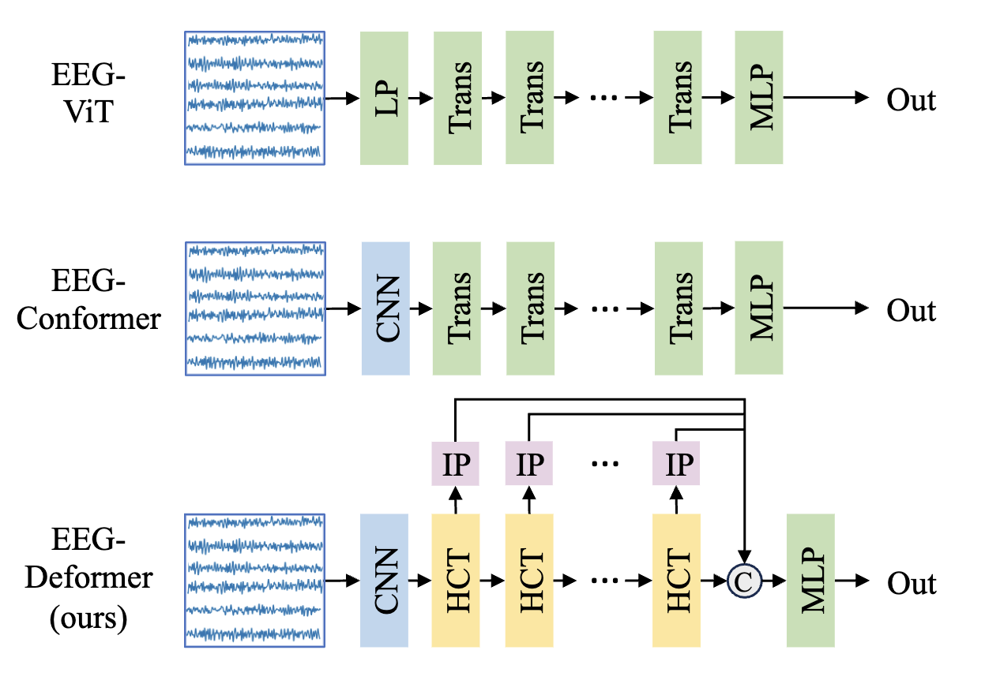
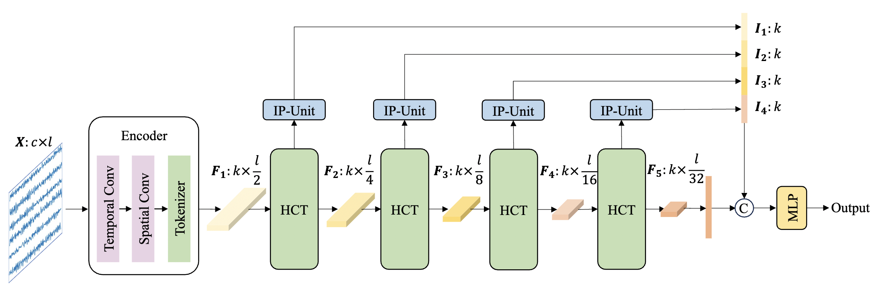

# EEG-Deformer
This is the PyTorch implementation of the EEG-Deformer in our paper:

Yi Ding, Yong Li, Hao Sun, Rui Liu, Chengxuan Tong, Chenyu Liu, Xinliang Zhou, and Cuntai Guan, ["EEG-Deformer: A Dense Convolutional Transformer for Brain-computer Interfaces"](https://ieeexplore.ieee.org/document/10763464) in IEEE Journal of Biomedical and Health Informatics (J-BHI), 2024. 

It is a Convolutional Transformer to decode mental states from Electroencephalography (EEG) for Brain-Computer Interfaces (BCI).
# Comparison with different Transformers for EEG signals
<p align="center">

</p>

<p align="center">
 Fig.1 Comparison of network architectures between EEG-ViT, EEG-Conformer, and our proposed EEG-Deformer. We propose a novel Hierarchical Coarse-to-Fine Transformer (HCT). Additionally, we have designed Information Purification Unit (IP-Unit, denoted by IP in the figure) for each HCT layer with dense connections to further boost EEG decoding performance.
</p>

# Network structure of EEG-Deformer
<p align="center">

</p>

<p align="center">
 Fig.2 EEG-Deformer structure
</p>

The network structure of EEG-Deformer. EEG-Deformer consists of three main parts: (1) Shallow feature encoder, (2) Hierarchical coarse-to-fine-Transformer (HCT), and (3) Dense information purification (DIP). The fine-grained representations from each HCT will be passed to Information Purification Unit (IP-Unit) and concatenated to the final embedding.

# Prepare the python virtual environment
Please create an anaconda virtual environment by:

> $ conda create --name PL python=3

Activate the virtual environment by:

> $ conda activate PL

Install the requirements by:

> $ pip3 install -r requirements.txt

# Run the code
Please download the pre-processed data for Fatigue dataset [here](https://drive.google.com/file/d/1KwPPSHN14MAbhszGqC1O5nRei7oqllxl/view?usp=sharing) and Mental Workload dataset [here](https://drive.google.com/file/d/1vPLPfkICdlXmzrlnmdR5hTjG7lvhZ2fV/view?usp=sharing). And put the upzipped folder inside the data_processed folder as
<pre>
Project/
│
├── models/
│   ├── EEGDeformer.py
│   ├── other_baselines.py
│   └── model_handler.py
│
├── data_processed/
│   ├── data_eeg_FATIG_FTG/     #the unziped folder
|   └── data_eeg_MWL_MW/
│
├── Task.py
├── utils.py
├── main_FATIG.py
├── main_MWL.py
├── requirements.txt
</pre>
You can run the code by: 

> $ python3 main_FATIG.py --model Deformer --full-run 1

The results will be saved into a folder named logs_<dataset_name>_<model_name>, e.g., logs_FATIG_Deformer in <args.save_path, default: ./save/logs_FATIG_Deformer/>. There will be a result.csv inside each sub-folder (subn) of logs_FATIG_Deformer.

After you finished all the training processes, you can use extract_results.py to calculate the mean metrics by:

> $ python3 extract_results.py --save-path ./save/logs_FATIG_Deformer

This will read all the result.csv files in the sub-folders within logs_FATIG_Deformer to calculate the mean ACCs and F1-macro scores.

# Apply EEG-Deformer to other datasets
If you are interested to apply EEG-Deformer to other datasets, you can follow the below example. 

## Example of the usage
```python
from models.EEGDeformer import Deformer

data = torch.randn(1, 30, 384)  # (batch_size=1, EEG_channel=30, data_points=384)  # change this according to your dataset

mynet = Deformer(
    num_chan=30,
    num_time=384,
    temporal_kernel=13,  # Use an odd number to ensure 'same' padding. The temporal kernel is defined as Odd[0.1*fs], where fs is the sampling rate, and Odd[.] will get the closest odd number.
    num_kernel=64,
    num_classes=2,
    depth=4,
    heads=16,
    mlp_dim=16,
    dim_head=16,
    dropout=0.5
)

preds = mynet(data)
```

# CBCR License
| Permissions | Limitations | Conditions |
| :---         |     :---:      |          :---: |
| :white_check_mark: Modification   | :x: Commercial use   | :warning: License and copyright notice   |
| :white_check_mark: Distribution     |       |      |
| :white_check_mark: Private use     |        |      |

# Cite
Please cite our paper if you use our code in your own work:

```
@ARTICLE{10763464,
  author={Ding, Yi and Li, Yong and Sun, Hao and Liu, Rui and Tong, Chengxuan and Liu, Chenyu and Zhou, Xinliang and Guan, Cuntai},
  journal={IEEE Journal of Biomedical and Health Informatics}, 
  title={EEG-Deformer: A Dense Convolutional Transformer for Brain-Computer Interfaces}, 
  year={2024},
  volume={},
  number={},
  pages={1-10},
  keywords={Electroencephalography;Transformers;Decoding;Kernel;Feature extraction;Convolution;Purification;Convolutional neural networks;Electronics packaging;IP networks;Deep learning;electroencephalography;transformer},
  doi={10.1109/JBHI.2024.3504604}}

```
Please do cite the dataset paper if you use their data:
```
@article{cao2019multi,
  title={Multi-channel {EEG} recordings during a sustained-attention driving task},
  author={Cao, Zehong and Chuang, Chun-Hsiang and King, Jung-Kai and Lin, Chin-Teng},
  journal={Scientific data},
  volume={6},
  number={1},
  pages={1--8},
  year={2019},
  publisher={Nature Publishing Group}
}
@Article{data4010014,
  AUTHOR = {Zyma, Igor and Tukaev, Sergii and Seleznov, Ivan and Kiyono, Ken and Popov, Anton and Chernykh, Mariia and Shpenkov, Oleksii},
  TITLE = {Electroencephalograms during Mental Arithmetic Task Performance},
  JOURNAL = {Data},
  VOLUME = {4},
  YEAR = {2019},
  NUMBER = {1},
  ARTICLE-NUMBER = {14},
  URL = {https://www.mdpi.com/2306-5729/4/1/14},
  ISSN = {2306-5729},
  DOI = {10.3390/data4010014}
}

```
